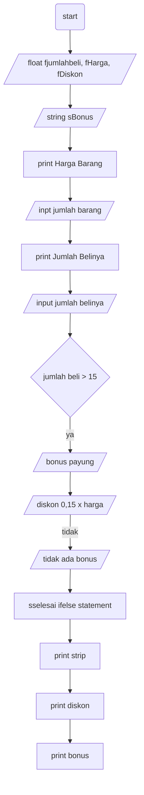

```mermaid
    flowchart TD;
    A(start) --> B[/float fjumlahbeli, fHarga, fDiskon/];
    B --> C[/string sBonus/];
    C --> D[print Harga Barang];
    D --> E[/inpt jumlah barang/];
    E --> F[print Jumlah Belinya];
    F --> G[/input jumlah belinya/];
    G --> H{jumlah beli > 15};
    H --ya--> I[/bonus payung/];
    I --> J[/diskon 0,15 x harga/];
    J --tidak--> K[/tidak ada bonus/];
    K --> O[sselesai ifelse statement];
    O --> M[print strip];
    M --> N[print diskon];
    N --> P[print bonus];
    
```